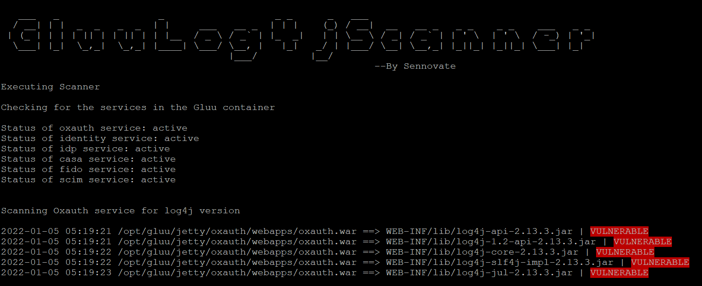

# GluuLog4jScanner
>Scan your Gluu container for vulnerable log4j files and patch the vulnerable Gluu servers.



<p align="center">
  <a href="https://github.com/Sennovate-Inc/GluuLog4jScanner/pulls">
    
  </a>
</p>

<p align="center">
  <a href="https://twitter.com/Sennovate" target="_blank">
    
  </a>
</p>

<br>

## **Overview:**
On the 9th of December 2021, a vulnerability, CVE-2021-44228, was disclosed concerning Apache Log4j, a popular open-source library. The vulnerability allows remote code execution and has been assigned a severity of 10.0, the highest possible, this vulnerability also affected the Gluu servers.

## **How to install**

Clone the repository using the below command
```bash
git clone https://github.com/Sennovate-Inc/GluuLog4jScanner.git
```

After the repository is downloaded, cd into the directory and install all the required modules using the below command

```python
pip3 install -r requirements.txt
```

## **How it works**

The log4jscanner is a simple tool, after the execution of the tool inside the Gluu container. It performs the following steps:<br/>
1. Scan for all the services that are running inside the Gluu container.<br/>
2. After getting the list of each service, it starts scanning the war file of each service. To check the version of all the log4j files used by these services.<br/>
3. The version is checked against the latest version of the jar files that are released by Apache officially.<br/>
4. Provide a detailed list of all the vulnerable files and the total no of files scanned.<br/>
5. If required user can also use the log4j scanner to patch the vulnerable file using the official automated script released by the Gluu.<br/>
6. Before applying the patch it also backup all the files, so the user has an option to revert to this state.

**Usage**
```python
python log4jscanner.py
```
The Log4jscanner also has an option so we can revert to the state before the patch has been applied using the '-r' flag.
```python
python log4jscanner.py -r
```
For more info. we can use the '-h' flag.
```python
python log4jscanner.py -h
```

## **References**
As being part of the open-source community, it didn't require us to "re-invent the wheel" completely. The log4jscanner is derived from the works of:

[Official Gluu patch](https://repo.gluu.org/upd/update_log4j.run) - Automated script to patch all the required jar files inside the Gluu container. <br/>
[Apache log4j 2 project ](https://logging.apache.org/log4j/2.x/index.html) - Developer of patched log4j jar files.<br/>


## **Contributing**

Please refer to the [CONTRIBUTING.md](CONTRIBUTING.md) file for more details and guidelines.

## **Legal Disclaimer:**
USE THIS TOOL AT YOUR OWN RISK. THIS TOOL COMES WITH NO WARRANTY, EITHER EXPRESS OR IMPLIED. THE SENNOVATE ORGANIZATION ASSUMES NO LIABILITY FOR THE USE OR MISUSE OF THIS SOFTWARE OR ITS DERIVATIVES.

THIS SOFTWARE IS OFFERED “AS-IS.” THE SENNOVATE ORGANIZATION WILL NOT INSTALL, REMOVE, OPERATE OR SUPPORT THIS SOFTWARE AT YOUR REQUEST. IF YOU ARE UNSURE OF HOW THIS SOFTWARE WILL INTERACT WITH YOUR SYSTEM, DO NOT USE IT.

## **Contact Info.**
For more info contact Sennovate - [support@sennovate.com](mailto:support@sennovate.com)

[](https://hits.seeyoufarm.com)
